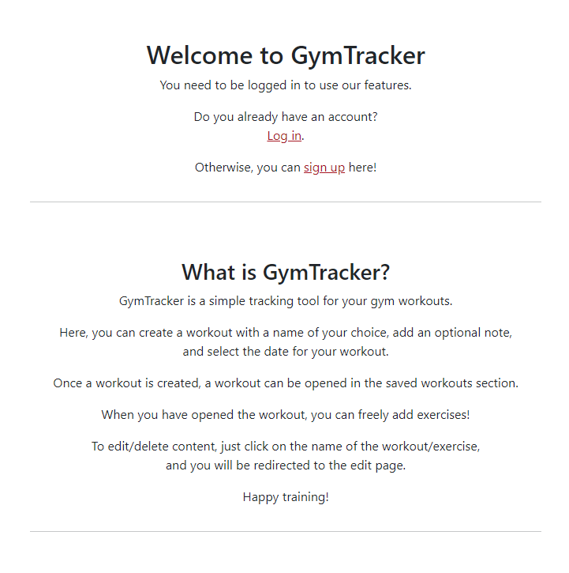

# [GYM TRACKER](https://gym-tracker-db-a73c4dc55708.herokuapp.com)

[](https://github.com/DavidFB94/gym-tracker/commits/main)
[](https://github.com/DavidFB94/gym-tracker/commits/main)
[](https://github.com/DavidFB94/gym-tracker)

## Overview
GymTracker is a website where users can find a simple tool for tracking and logging their gym workouts.

GymTracker allows the user to create workouts, where they can freely add exercises, and leave a note for workout reminders. A workout name and date can be added, so the workout can be easily identified if it needs to be accessed at a later time.

This website was built as a project for the Diploma in Full Stack Software Development at Code Institute.

## Mock-up


## UX

I started out with Wireframes for both desktop and mobile.

After creating the basic structure for the page according to the wireframes, I realized that I was trying to create too much functionality using only one html page using modals. I decided to shift things around, so I put the forms in separate html-files. This also helped in keeping the home page less cluttered with information, especially on smaller screens.

After this shift, my focus was on keeping the user experience smooth, reducing the amount of actions needed, and keep important information visible. For this reason, I decided to add the list of exercises to the "add exercises" page, so it would be easier for the user to keep track of what they have already added to their workout. I also adjusted the back button to bring the user back to the "add exercises" page (instead of going back to the home page) after editing an exercise, in case the user wants to keep editing different exercises.

### Color Scheme

I wanted the site to have a simple look, while keeping the information easily readable. For that reason, I had to adjust my color theme towards the end of the project.

- `#212529` used for primary text.
- `#fff` used for secondary text.
- `#AD1A26` used for highlights + links.

I used [coolors.co](https://coolors.co/212529-ad1a26-9c1c27-ffe600-ffffff) to generate my color palette.


### Typography

Font was applied automatically by Bootstrap, which selects the best `font-family` for each OS and device.

- [Bootstraps native font stack](https://getbootstrap.com/docs/5.0/content/reboot/#native-font-stack) was used for all text content.

- [Font Awesome](https://fontawesome.com/icons/rectangle-list?f=sharp&s=regular) icon was used for the favicon.

- [GitHub](https://github.com/logos) icon was used for the GitHub link.

## User Stories

### Site Users

- As a site user I can register an account so that I can log in, and use the site in an authorized and secure way.
- As a site user I can log in with my account information so that I can use the sites features.
- As a site user I can log out from my account so that I can avoid unauthorized access to my data.
- As a site user I can create a workout so that I can plan/track my workout schedule.
- As a site user I can view saved workouts so that I can access the saved information.
- As a site user I can delete saved workouts so that I can remove workouts that I no longer wish to track.
- As a site user I can create exercises so that I can make add them to my workout.
- As a site user I can view my exercises in a workout so that I can plan/track my workout.
- As a site user I can update my exercises so that I make can make changes if required.
- As a site user I can delete saved exercises so that I can remove exercises that I no longer wish to track.
- (Future feature) As a site user I can filter saved workouts so that I can find the workout I'm looking for more easily.
- (Future feature) As a site user I can create a workout plan so that I can re-use workouts more easily.
- (Future feature) As a site user I can add my personal profile so that I can add additional information.
- (Future feature) As a site user I can create a workout calendar so that I can plan my workout activity.
- (Future feature) As a site user I can receive reminders from the app so that I can achieve better adherence to my workout plan.
- (Future feature) As a site user I can view my saved data so that I can get an overview of my activity/progress.
- (Future feature) As a site user I can fill in a feedback form so that I can submit development requests to the site administrator.

### Site Admin

- As a site admin I can moderate users and their data so that I can make changes when required.
- (Future feature) As a site admin I can store feedback messages in the database so that I can review them.
- (Future feature) As a site admin I can I can mark feedback messages as "read" so that I can keep track on which messages I have reviewed.

## Wireframes

Wireframes were developed for mobile and desktop.
I've used [Balsamiq](https://balsamiq.com/wireframes) to design my site wireframes.

### Mobile Wireframes

<details>
<summary> Click here to see the Mobile Wireframes </summary>

Home
  - 

Add/edit workout
  - 

</details>

### Desktop Wireframes

<details>
<summary> Click here to see the Desktop Wireframes </summary>

Home
  - 

Add/edit workout
  - 

</details>

## Features

### Existing Features

- **#1 - Landing page**

    - Landing page with a call to sign up to use the sites features, and usage instructions for the site. Links to login and signup (for new users), to direct the user to the appropriate action.



- **#2 - Navbar menu, home navigation logo, login status**

    - Navbar with menu that changes with login status. Includes home navigation logo and hover effects. Adds visual feedback for the user.


- **#3 - Dropdown nav menu for mobile users**

    - Dropdown menu for mobile users. Adds maneuverability to the site for smaller screen sizes.


- **#4 - Sign up page**

    - Signup form for new users, with link to login screen in case a returning user ends up in the wrong page. Adds maneuverability to the site.


- **#5 - Log in page**

    - Log in form for returning users, with link to sign up screen in case a new user ends up in the wrong page. Adds maneuverability to the site.


- **#6 - Submission confirmations**

    - Form submission confirmation area, to inform the user when an action has been successful. Adds visual feedback for the user.


- **#7 - Saved workouts**

    - Saved workouts area with pagination of workouts. Pagination for avoiding clutter, and avoid excessive scrolling for smaller screen sizes.


- **#8 - Add workout**

    - Button to add workout. Opens the "add workout" form. Added hover effect (used on all the sites buttons), to increase visual feedback for the user. 


- **#9 - Create workout**

    - Create workout form. Allows the user to name the workout, add an optional note for reminders, and select the workout date (date input field for easy date picking).


- **#10 - Workout card/module**

    - Opens when a saved workout is selected. Workout title functions as a link to "edit workout" form. Shows workout date. "Add exercise" button to open add exercise form. Displays added exercises. Exercise name functions as a link to "edit exercise" form. Exercises displayed in table with name, weight, sets and reps.


- **#11 - Edit workout**

    - Opens when workout title is clicked in module. Displays same fields as "create workout" form, but with option to update and delete workout.


- **#12 - Add exercise**

    - Opens when exercise name is clicked in module or in "edit exercise" page. It allows the user to name the exercise, write weight, sets and reps. It also displays a list of existing exercises in the workout, to allow the user to see and be able to easily select exercises that might need to be edited/deleted. If an exercise name is clicked while in this page, the "edit exercise" form for that exercise will be opened.
Free text is allowed in most fields to grant the user full freedom to track their exercises in the way they want.


- **#13 - Edit exercise**

    - Opens when exercise name is clicked in module or in add exercise page. Displays same fields as "add exercise" form, but with option to update and delete exercise. It also displays a list of existing exercises in the workout, to allow the user to see and be able to easily select more exercises that might need to be edited/deleted. If an exercise name is clicked while in this page, the "edit exercise" form for that exercise will be opened.
Free text is allowed in most fields to grant the user full freedom to track their exercises in the way they want.


- **#14 - Delete confirmation**

    - All delete actions will trigger a delete confirmation module, to prevent the user from accidentally deleting content.


- **#15 - Footer with GitHub link**

    - Where the user can get information about the developer, and find the developers GitHub link.


- **#16 - Log out page**

    - Log out page with log out confirmation. Allows the user to log out, in case they want their account and saved content to not be accessed.


### Future Features

- #1 - Filter saved workouts
    - Be able to filter by date ranges
- #2 - Create workout calendar
- #3 - Receive reminders
- #4 - Create workout template
    - Be able to re-use workouts.
 - #5 - User profile
 - #6 - View activity/progress
    - Show graph of activity/progress
 - #7 - Send feedback
 - #8 - (Admin) Receive feedback
 - #9 - (Admin) Organize feedback

## Tools & Technologies Used

- [](https://tim.2bn.dev/markdown-builder) used to generate README and TESTING templates.
- [](https://git-scm.com) used for version control. (`git add`, `git commit`, `git push`)
- [](https://github.com) used for secure online code storage.
- [](https://gitpod.io) used as a cloud-based IDE for development.
- [](https://en.wikipedia.org/wiki/HTML) used for the main site content.
- [](https://en.wikipedia.org/wiki/CSS) used for the main site design and layout.
- [](https://www.javascript.com) used for user interaction on the site.
- [](https://www.python.org) used as the back-end programming language.
- [](https://www.heroku.com) used for hosting the deployed back-end site.
- [](https://getbootstrap.com) used as the front-end CSS framework for modern responsiveness and pre-built components.
- [](https://www.djangoproject.com) used as the Python framework for the site.
- [](https://dbs.ci-dbs.net) used as the Postgres database from Code Institute.
- [](https://whitenoise.readthedocs.io) used for serving static files with Heroku.
- [](https://balsamiq.com/wireframes) used for creating wireframes.
- [](https://fontawesome.com) used for the favicon.
- [](https://chat.openai.com) used to help debug, troubleshoot, and explain things.

## Database Design

Entity Relationship Diagrams (ERD) help to visualize database architecture before creating models.
Understanding the relationships between different tables can save time later in the project.

```python
class Workout:
	user = ForeignKey(User, on_delete=models.CASCADE)
	name = CharField(max_length=100, null=False, blank=False)
	note = TextField(null=True, blank=True)
	date = DateField(null=False, blank=False)
```

```python
class Exercise:
	workout = ForeignKey(
		Workout,on_delete=models.CASCADE,related_name="exercises")
	name = CharField(max_length=50, null=False, blank=False)
	weight = CharField(max_length=30, null=False, blank=False)
	sets = PositiveIntegerField(null=False, blank=False)
	reps = CharField(max_length=20, null=False, blank=False)
```

## Agile Development Process

### GitHub Projects

[GitHub Projects](https://github.com/DavidFB94/gym-tracker/projects) served as an Agile tool for this project.
It isn't a specialized tool, but with the right tags and project creation/issue assignments, it can be made to work.

Through it, user stories, issues, and milestone tasks were planned, then tracked weekly using the basic Kanban board.


### GitHub Issues

[GitHub Issues](https://github.com/DavidFB94/gym-tracker/issues) served as an another Agile tool.
There, I used my own **User Story Template** to manage user stories.

It also helped with milestone iterations on a weekly basis.

- [Open Issues](https://github.com/DavidFB94/gym-tracker/issues) [](https://github.com/DavidFB94/gym-tracker/issues)

    

- [Closed Issues](https://github.com/DavidFB94/gym-tracker/issues?q=is%3Aissue+is%3Aclosed) [](https://github.com/DavidFB94/gym-tracker/issues?q=is%3Aissue+is%3Aclosed)

    

### MoSCoW Prioritization

I've decomposed my Epics into stories prior to prioritizing and implementing them.
Using this approach, I was able to apply the MoSCow prioritization and labels to my user stories within the Issues tab.

- **Must Have**: guaranteed to be delivered (*max 60% of stories*)
- **Should Have**: adds significant value, but not vital (*the rest ~20% of stories*)
- **Could Have**: has small impact if left out (*20% of stories*)
- **Won't Have**: not a priority for this iteration

## Testing

> [!NOTE]  
> For all testing, please refer to the [TESTING.md](TESTING.md) file.

## Deployment

The live deployed application can be found deployed on [Heroku](https://gym-tracker-db-a73c4dc55708.herokuapp.com).

### PostgreSQL Database

This project uses a [Code Institute PostgreSQL Database](https://dbs.ci-dbs.net).

To obtain my own Postgres Database from Code Institute, I followed these steps:

- Signed-in to the CI LMS using my email address.
- An email was sent to me with my new Postgres Database.

> [!CAUTION]  
> - PostgreSQL databases by Code Institute are only available to CI Students.
> - You must acquire your own PostgreSQL database through some other method
> if you plan to clone/fork this repository.
> - Code Institute students are allowed a maximum of 8 databases.
> - Databases are subject to deletion after 18 months.

### Cloudinary API but WHITENOISE??

This project uses the [Cloudinary API](https://cloudinary.com) to store media assets online, due to the fact that Heroku doesn't persist this type of data.

To obtain your own Cloudinary API key, create an account and log in.

- For *Primary interest*, you can choose *Programmable Media for image and video API*.
- Optional: *edit your assigned cloud name to something more memorable*.
- On your Cloudinary Dashboard, you can copy your **API Environment Variable**.
- Be sure to remove the `CLOUDINARY_URL=` as part of the API **value**; this is the **key**.

### Heroku Deployment

This project uses [Heroku](https://www.heroku.com), a platform as a service (PaaS) that enables developers to build, run, and operate applications entirely in the cloud.

Deployment steps are as follows, after account setup:

- Select **New** in the top-right corner of your Heroku Dashboard, and select **Create new app** from the dropdown menu.
- Your app name must be unique, and then choose a region closest to you (EU or USA), and finally, select **Create App**.
- From the new app **Settings**, click **Reveal Config Vars**, and set your environment variables.

> [!IMPORTANT]  
> This is a sample only; you would replace the values with your own if cloning/forking my repository.

| Key | Value |
| --- | --- |
| `CLOUDINARY_URL` | user's own value |
| `DATABASE_URL` | user's own value |
| `DISABLE_COLLECTSTATIC` | 1 (*this is temporary, and can be removed for the final deployment*) |
| `SECRET_KEY` | user's own value |

Heroku needs three additional files in order to deploy properly.

- requirements.txt
- Procfile
- runtime.txt

You can install this project's **requirements** (where applicable) using:

- `pip3 install -r requirements.txt`

If you have your own packages that have been installed, then the requirements file needs updated using:

- `pip3 freeze --local > requirements.txt`

The **Procfile** can be created with the following command:

- `echo web: gunicorn app_name.wsgi > Procfile`
- *replace **app_name** with the name of your primary Django app name; the folder where settings.py is located*

The **runtime.txt** file needs to know which Python version you're using:
1. type: `python3 --version` in the terminal.
2. in the **runtime.txt** file, add your Python version:
	- `python-3.9.18`

For Heroku deployment, follow these steps to connect your own GitHub repository to the newly created app:

Either:

- Select **Automatic Deployment** from the Heroku app.

Or:

- In the Terminal/CLI, connect to Heroku using this command: `heroku login -i`
- Set the remote for Heroku: `heroku git:remote -a app_name` (replace *app_name* with your app name)
- After performing the standard Git `add`, `commit`, and `push` to GitHub, you can now type:
	- `git push heroku main`

The project should now be connected and deployed to Heroku!

### Local Deployment

This project can be cloned or forked in order to make a local copy on your own system.

For either method, you will need to install any applicable packages found within the *requirements.txt* file.

- `pip3 install -r requirements.txt`.

You will need to create a new file called `env.py` at the root-level,
and include the same environment variables listed above from the Heroku deployment steps.

> [!IMPORTANT]  
> This is a sample only; you would replace the values with your own if cloning/forking my repository.

Sample `env.py` file:

```python
import os

os.environ.setdefault("CLOUDINARY_URL", "user's own value")
os.environ.setdefault("DATABASE_URL", "user's own value")
os.environ.setdefault("SECRET_KEY", "user's own value")

# local environment only (do not include these in production/deployment!)
os.environ.setdefault("DEBUG", "True")
```

Once the project is cloned or forked, in order to run it locally, you'll need to follow these steps:

- Start the Django app: `python3 manage.py runserver`
- Stop the app once it's loaded: `CTRL+C` or `⌘+C` (Mac)
- Make any necessary migrations: `python3 manage.py makemigrations`
- Migrate the data to the database: `python3 manage.py migrate`
- Create a superuser: `python3 manage.py createsuperuser`
- Load fixtures (if applicable): `python3 manage.py loaddata file-name.json` (repeat for each file)
- Everything should be ready now, so run the Django app again: `python3 manage.py runserver`

#### Cloning

You can clone the repository by following these steps:

1. Go to the [GitHub repository](https://github.com/DavidFB94/gym-tracker) 
2. Locate the Code button above the list of files and click it 
3. Select if you prefer to clone using HTTPS, SSH, or GitHub CLI and click the copy button to copy the URL to your clipboard
4. Open Git Bash or Terminal
5. Change the current working directory to the one where you want the cloned directory
6. In your IDE Terminal, type the following command to clone my repository:
	- `git clone https://github.com/DavidFB94/gym-tracker.git`
7. Press Enter to create your local clone.

Alternatively, if using Gitpod, you can click below to create your own workspace using this repository.

[](https://gitpod.io/#https://github.com/DavidFB94/gym-tracker)

Please note that in order to directly open the project in Gitpod, you need to have the browser extension installed.
A tutorial on how to do that can be found [here](https://www.gitpod.io/docs/configure/user-settings/browser-extension).

#### Forking

By forking the GitHub Repository, we make a copy of the original repository on our GitHub account to view and/or make changes without affecting the original owner's repository.
You can fork this repository by using the following steps:

1. Log in to GitHub and locate the [GitHub Repository](https://github.com/DavidFB94/gym-tracker)
2. At the top of the Repository (not top of page) just above the "Settings" Button on the menu, locate the "Fork" Button.
3. Once clicked, you should now have a copy of the original repository in your own GitHub account!

### Local VS Deployment

No significant differences between local vs deployed version.

## Credits

The Django project base was set up following Code Institutes walkthrough. 

In base.html template, the header with navbar, logged in status and Django messages display was copied from the same walkthrough project.

In home.html template, the pagination was copied from Code Institutes walkthrough.

### Content

| Source | Location | Notes |
| --- | --- | --- |
| [Markdown Builder](https://tim.2bn.dev/markdown-builder) | README and TESTING | tool to help generate the Markdown files |
| [Djangoproject](https://docs.djangoproject.com/en/5.0/topics/db/models/) | models.py | Setting up models |
| [Djangoproject](https://docs.djangoproject.com/en/5.0/ref/contrib/messages/) | views.py | Setting up Django messages |
| [Djangoproject](https://docs.djangoproject.com/en/5.0/topics/pagination/#using-paginator-in-a-view-function) | views.py | Setting up Django pagination in view |
| [Bootstrap](https://getbootstrap.com/docs/5.3/layout/grid/) | Page layout | Using Bootstrap grid system |
| [Bootstrap](https://getbootstrap.com/docs/5.3/components/modal/) | Workout cards, delete confirmations | Setting up Modals |
| [Bootstrap](https://getbootstrap.com/docs/5.3/content/tables/) | Exercise list | Setting up tables |
| [Bootstrap](https://getbootstrap.com/docs/5.3/components/card/) | Workout cards | Setting up cards |
| [YouTube](https://www.youtube.com/watch?v=wmYSKVWOOTM&ab_channel=PrettyPrinted) | views.py | Setting up pagination |
| [YouTube](https://www.youtube.com/watch?v=MZwKoi0wu2Q&ab_channel=BugBytes) | forms.py | How to use widgets in Django forms, setting up Date Input field |
| [YouTube](https://www.youtube.com/watch?v=quJzUzCs6Q0&ab_channel=CodingEntrepreneurs) | forms.py | How to use attributes in Django forms, hide labels, placeholder text |
| [Django-crispy-forms](https://django-crispy-forms.readthedocs.io/en/latest/index.html) | Forms | How to utilize crispy forms |
| [WhiteNoise](http://whitenoise.evans.io) | entire site | hosting static files on Heroku temporarily |

### Media

| Source | Location | Type | Notes |
| --- | --- | --- | --- |
| [FontAwesome](fontawesome.com/icons/rectangle-list?f=sharp&s=regular) | entire site | image | favicon on all pages |
| [GitHub](https://github.com/logos) | footer | image | GitHub link icon in footer |

### Acknowledgements

- I would like to thank my Code Institute mentor, [Tim Nelson](https://github.com/TravelTimN) for his support throughout the development of this project.
- I would like to thank my wife Maria for believing in me, and allowing me to make this transition into software development.