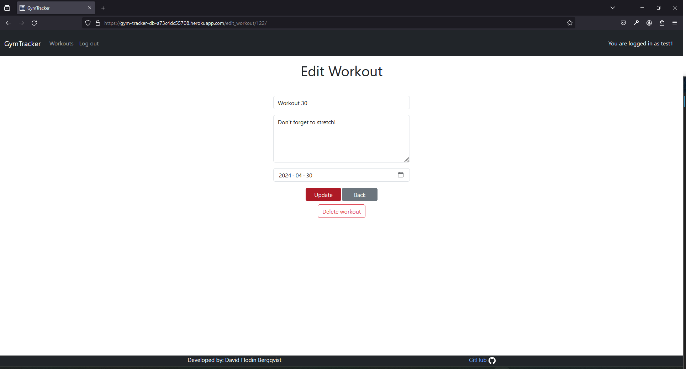

# Testing

> [!NOTE]  
> Return back to the [README.md](README.md) file.

## Code Validation

### HTML

I have used the recommended [HTML W3C Validator](https://validator.w3.org) to validate all of my HTML files.

| Directory | File | Screenshot | Notes |
| --- | --- | --- | --- |
| home | add_exercise.html |  | No errors |
| home | add_workout.html |  | No errors |
| home | edit_exercise.html |  | Missing divs (fixed) |
| home | edit_workout.html |  | Missing divs (fixed) |
| home | home.html |  | No errors |

### CSS

I have used the recommended [CSS Jigsaw Validator](https://jigsaw.w3.org/css-validator) to validate all of my CSS files.

| Directory | File | Screenshot | Notes |
| --- | --- | --- | --- |
| static | style.css |  | |

### Python

I have used the recommended [PEP8 CI Python Linter](https://pep8ci.herokuapp.com) to validate all of my Python files.

| Directory | File | CI URL | Screenshot | Notes |
| --- | --- | --- | --- | --- |
| home | admin.py | [PEP8 CI](https://pep8ci.herokuapp.com/https://raw.githubusercontent.com/DavidFB94/gym-tracker/main/home/admin.py) |  | |
| home | forms.py | [PEP8 CI](https://pep8ci.herokuapp.com/https://raw.githubusercontent.com/DavidFB94/gym-tracker/main/home/forms.py) |  | |
| home | models.py | [PEP8 CI](https://pep8ci.herokuapp.com/https://raw.githubusercontent.com/DavidFB94/gym-tracker/main/home/models.py) |  | |
| home | urls.py | [PEP8 CI](https://pep8ci.herokuapp.com/https://raw.githubusercontent.com/DavidFB94/gym-tracker/main/home/urls.py) |  | |
| home | views.py | [PEP8 CI](https://pep8ci.herokuapp.com/https://raw.githubusercontent.com/DavidFB94/gym-tracker/main/home/views.py) |  | |
| home | tests.py | [PEP8 CI](https://pep8ci.herokuapp.com/https://raw.githubusercontent.com/DavidFB94/gym-tracker/main/home/views.py) |  | |
| home | apps.py | [PEP8 CI](https://pep8ci.herokuapp.com/https://raw.githubusercontent.com/DavidFB94/gym-tracker/main/home/views.py) |  | |
|  | manage.py | [PEP8 CI](https://pep8ci.herokuapp.com/https://raw.githubusercontent.com/DavidFB94/gym-tracker/main/manage.py) |  | |
| my_project | urls.py | [PEP8 CI](https://pep8ci.herokuapp.com/https://raw.githubusercontent.com/DavidFB94/gym-tracker/main/my_project/urls.py) |  | |

## Browser Compatibility

I've tested my deployed project on multiple browsers to check for compatibility issues.

| Browser | Home  | Add workout | Edit workout | Add exercise | Notes |
| --- | --- | --- | --- | --- | --- |
| Chrome |  |  |  |  |  Works as expected |
| Firefox |  |  |  |  | Works as expected |
| Edge |  |  |  |  | Works as expected |

## Responsiveness

I've tested my deployed project on multiple devices to check for responsiveness issues.

| Device | home | Add workout | Edit workout | Add exercise | Notes |
| --- | --- | --- | --- | --- |  --- |
| Mobile (DevTools) |  |  |  |  | Works as expected.  |
| Tablet (DevTools) |  |  |  |  | Works as expected |
| Desktop |  |  |  |  | Works as expected |
| Sony Xperia 10 |  |  |  |  | Works as expected |

