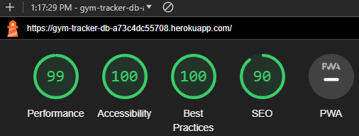
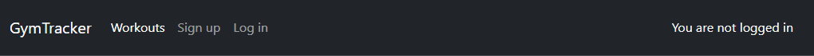
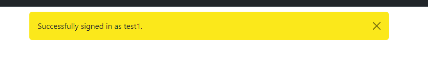
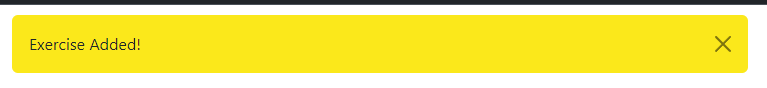
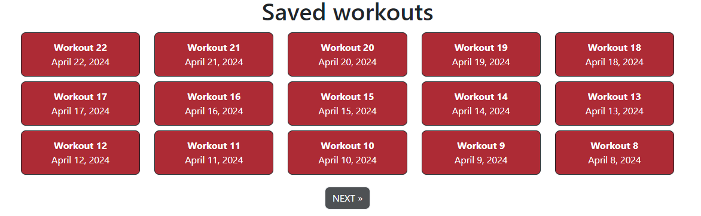
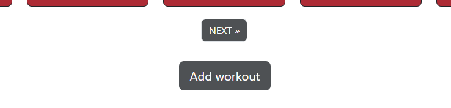
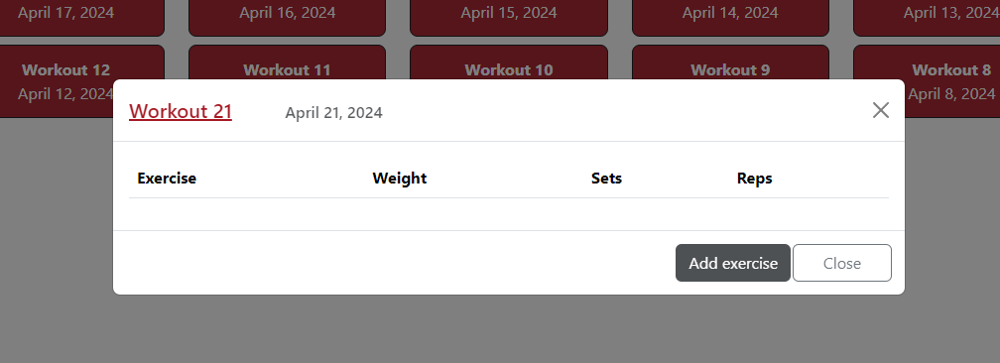
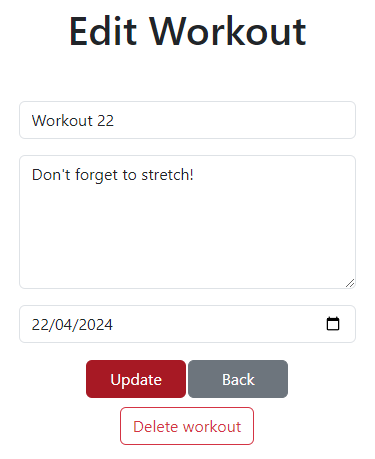
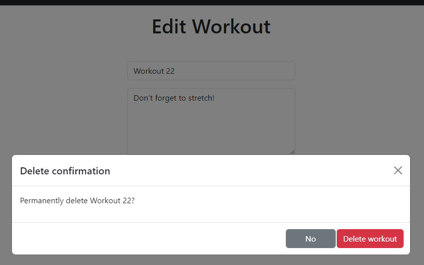

# Testing

> [!NOTE]  
> Return back to the [README.md](README.md) file.

## Code Validation

### HTML

I have used the recommended [HTML W3C Validator](https://validator.w3.org) to validate all of my HTML files.

| Directory | File | Screenshot | Notes |
| --- | --- | --- | --- |
| home | add_exercise.html |  | No errors |
| home | add_workout.html |  | No errors |
| home | edit_exercise.html |  | Missing /divs (fixed) |
| home | edit_workout.html |  | Missing /divs (fixed) |
| home | home.html |  | No errors |

### CSS

I have used the recommended [CSS Jigsaw Validator](https://jigsaw.w3.org/css-validator) to validate all of my CSS files.

| Directory | File | Screenshot | Notes |
| --- | --- | --- | --- |
| static | style.css |  | |

### Python

I have used the recommended [PEP8 CI Python Linter](https://pep8ci.herokuapp.com) to validate all of my Python files.

| Directory | File | CI URL | Screenshot | Notes |
| --- | --- | --- | --- | --- |
| home | admin.py | [PEP8 CI](https://pep8ci.herokuapp.com/https://raw.githubusercontent.com/DavidFB94/gym-tracker/main/home/admin.py) |  | |
| home | forms.py | [PEP8 CI](https://pep8ci.herokuapp.com/https://raw.githubusercontent.com/DavidFB94/gym-tracker/main/home/forms.py) |  | |
| home | models.py | [PEP8 CI](https://pep8ci.herokuapp.com/https://raw.githubusercontent.com/DavidFB94/gym-tracker/main/home/models.py) |  | |
| home | urls.py | [PEP8 CI](https://pep8ci.herokuapp.com/https://raw.githubusercontent.com/DavidFB94/gym-tracker/main/home/urls.py) |  | |
| home | views.py | [PEP8 CI](https://pep8ci.herokuapp.com/https://raw.githubusercontent.com/DavidFB94/gym-tracker/main/home/views.py) |  | |
| home | tests.py | [PEP8 CI](https://pep8ci.herokuapp.com/https://raw.githubusercontent.com/DavidFB94/gym-tracker/main/home/views.py) |  | |
| home | apps.py | [PEP8 CI](https://pep8ci.herokuapp.com/https://raw.githubusercontent.com/DavidFB94/gym-tracker/main/home/views.py) |  | |
|  | manage.py | [PEP8 CI](https://pep8ci.herokuapp.com/https://raw.githubusercontent.com/DavidFB94/gym-tracker/main/manage.py) |  | |
| my_project | urls.py | [PEP8 CI](https://pep8ci.herokuapp.com/https://raw.githubusercontent.com/DavidFB94/gym-tracker/main/my_project/urls.py) |  | |

## Browser Compatibility

I've tested my deployed project on multiple browsers to check for compatibility issues.

| Browser | Home  | Add workout | Edit workout | Add exercise | Notes |
| --- | --- | --- | --- | --- | --- |
| Chrome |  |  |  |  |  Works as expected |
| Firefox |  |  |  |  | Works as expected |
| Edge |  |  |  |  | Works as expected |

## Responsiveness

I've tested my deployed project on multiple devices to check for responsiveness issues.

| Device | home | Add workout | Edit workout | Add exercise | Notes |
| --- | --- | --- | --- | --- |  --- |
| Mobile (DevTools) |  |  |  |  | Works as expected.  |
| Tablet (DevTools) |  |  |  |  | Works as expected |
| Desktop |  |  |  |  | Works as expected |
| Sony Xperia 10 |  |  |  |  | Works as expected |

## Lighthouse Audit

I've tested my deployed project using the Lighthouse Audit tool to check for any major issues.

| Page | Mobile | Desktop | Notes |
| --- | --- | --- | --- |
| Home |  |  | Some minor warnings |
| Add workout |  |  | Some minor warnings |
| Edit workout |  |  | Some minor warnings |
| Add exercise |  |  | Some minor warnings |

## Defensive Programming

Defensive programming was manually tested with the below user acceptance testing:

| Page | Expectation | Test | Result | Fix | Screenshot |
| --- | --- | --- | --- | --- | --- |
| Home | | | | | |
| | Feature is expected to direct the user to login/signup page when links are clicked | Tested the feature by clicking both links | The feature behaved as expected. When clicking login, I got redirected to the login page. When clicking sign up, I got directed to the sign up page | Test concluded and passed |  |
| | Feature is expected to be directed to home page when site logo is clicked. Feature is also expected to change the menu and logged in status based on user and logged in status. | Tested the feature by clicking the site logo after selecting the log in link. Tested the feature by logging in. | The feature behaved as expected. When site logo is clicked, I get redirected to home. After logging in, the menu changes, and the logged in status changes based on user name | Test concluded and passed |  |
| | Feature is expected to change the navbar menu to dropdown on smaller screens. | Tested the feature by changing the screen size to small | The feature behaved as expected. When changing the screen size to small, the nav menu changed to dropdown. When burger icon was clicked, the nav menu appeared | Test concluded and passed |  |
| | Feature is expected to create a new account on form submission (with required field input), and log in the user. Log in link is expected to take the user to the login page | Tested the feature by first clicking the log in link in sign up, then going back to signup from login and submit the  sign up form with username and password | The feature behaved as expected. When link to log in page is clicked, I got redirected to the log in page. When submitting the sign up form with the required information (and not an already existing username), I got logged in automatically, and redirected to home | Test concluded and passed |  |
| | Feature is expected to log in the user when correct information is submitted (required field input). Sign up link is expected to take the user to the signup page | Tested the feature by first clicking the sign up link, then going back to login from signup and submit the log in form with correct username and password | The feature behaved as expected. When link to sign up page is clicked, I got redirected to the sign up page. When submitting the login form with the required information, I got logged in, and redirected to home | Test concluded and passed |  |
| | Feature is expected to display a feedback message when an submission/deletion is successful, or when an unauthorized action is performed | Tested the feature by logging in/signing up, creating/updating workout, adding/editing exercise, deleting workout/exercise, and trying to brute force URLs from other users. | The feature behaved as expected. When submission/deletion is performed, the message is displayed. When a user tries to access another users content, an error message is displayed. | Test concluded and passed |   |
| | Feature is expected to displayed saved workouts (with pagination), which can be selected when clicked | Tested the feature by first adding a workout, then selecting the workout. To test pagination, I added enough workouts for pagination to trigger (16) | The feature behaved as expected. When a saved workout is selected, a module with the workouts content and option to add exercises opens. When more than 15 workouts exist, the pagination triggers | Test concluded and passed |  |
| | Feature is expected to redirect to the add workout page when clicked, and change color when hovered. | Tested the feature by hovering the button, then clicking it | The feature behaved as expected. When the button is hovered, the color changes. When the button is clicked, the user is redirected to the add workout page | Test concluded and passed |  |
| | Feature is expected to allow the user to fill in workout name (required), note (optional) and workout date (required). On form submission, the workout should appear in saved workouts | Tested the feature by trying to submit without filling out required fields. Then the form was submitted with correct input | The feature behaved as expected. Form can not be submitted without the required input. With correct input, the form is submitted and workout is displayed in the saved workouts section  | Test concluded and passed |  |
| | Feature is expected to open when a saved workout is selected. It is expected to show workout name, show date and added exercises to that workout. The names should be clickable links to edit workout/exercise. The add exercise button should redirect the user to the add exercise page. The close button should close the module | Tested the feature by selecting a workout, and clicking the close button. Re-opened the workout. I clicked the name of the workout. I went back to home page, and opened the workout again. Clicking add exercise button, added an exercise. Back to home, opened the workout again. | The feature behaved as expected. Module opens when workout is selected. Close button closes the module. Workout name, date and exercises are displayed. When workout name is clicked, I got redirected to edit workout page. Add exercise button redirected me to add exercise page. When an added exercise name is clicked, I got redirected to edit workout page | Test concluded and passed |  |
| | Feature is expected to show edit workout page, and let the user view the workout note, update and delete the workout | Tested the feature by changing information in the workout and click update. Form can not be submitted with missing required input. Re-opened the same edit workout, and clicked the delete button | The feature behaved as expected. The edit workout page gets displayed. After inputting new data into form and clicking submit, I get redirected to home and can re-open the workout, where the updated data is displayed. Re-opening the same edit workout, I click delete workout, accept the delete confirmation. The workout is deleted, and is no longer displayed in saved workouts section | Test concluded and passed |  |
| | Feature is expected to show add exercise page, and let the user add exercises to their selected workout. The add exercise page also display already added exercises, with clickable links to edit already added exercises. Form can not be submitted with missing input | Tested the feature by clicking the add exercise button in the workout module, and adding an exercise. I clicked an already added exercise to get redirected to the edit exercise page | The feature behaved as expected. The add exercise page gets displayed, and already added exercises are displayed beneath the form. After form input and submission, the page refreshes to add additional exercises. Form can not be submitted with missing required input. The added exercises names can be clicked to open the corresponding exercises edit exercise page | Test concluded and passed |  |
| | Feature is expected to show edit exercise page, and let the user update and delete the exercise | Tested the feature by changing information in the exercise and click update. Form can not be submitted with missing required input. Re-opened the same edit exercise page and deleted the exercise | The feature behaved as expected. The edit exercise page gets displayed. After inputting new data into form and clicking submit, I get redirected to home and can re-open the workout, where the updated exercise is displayed. Re-opening the same edit exercise, I click delete exercise, accept the delete confirmation. The exercise is deleted, and is no longer displayed in that workout module | Test concluded and passed |  |
| | Feature is expected to display a delete confirmation module, triggered by a delete action | Tested the feature by trying to delete a workout and an exercise | The feature behaved as expected. When selecting a delete action, the module is triggered, and I have to confirm my action before the workout/exercise is deleted | Test concluded and passed |  |
| | Feature is expected to redirect the user to GitHub (in a new page) when the link is clicked| Tested the feature by clicking the link | The feature behaved as expected, it opened the GitHub profile in a new tab | Test concluded and passed |  |
| | Feature is expected to redirect the user to a confirmation page when the log out link is clicked in the navbar | Tested the feature by clicking the link | The feature behaved as expected. I got redirected to a log out confirmation page, where my action has to be confirmed before logging me out | Test concluded and passed |  |
| | Feature is expected to prevent a regular user from accessing the admin panel | Tested the feature by adding /admin to the URL as a regular user | The feature behaved as expected. I got redirected to a login page where I was prompted to login as a user with authorization | Test concluded and passed |  |

## User Story Testing

| User Story | Screenshot |
| --- | --- |
| As a site user I can register an account so that I can log in, and use the site in an authorized and secure way. |  |
| As a site user I can log in with my account information so that I can use the sites features. |  |
|  As a site user I can log out from my account so that I can avoid unauthorized access to my data. |  |
| As a site user I can create a workout so that I can plan/track my workout schedule. |  |
| As a site user I can view saved workouts so that I can access the saved information. |  |
| As a site user I can delete saved workouts so that I can remove workouts that I no longer wish to track. |  |
| As a site user I can create exercises so that I can add them to my workout. |  |
| As a site user I can view my exercises in a workout so that I can plan/track my workout. |  |
| As a site user I can update my exercises so that I make can make changes if required. |  |
| As a site user I can delete saved exercises so that I can remove exercises that I no longer wish to track. |  |
| As a site admin I can moderate users and their data so that I can make changes when required. |  |